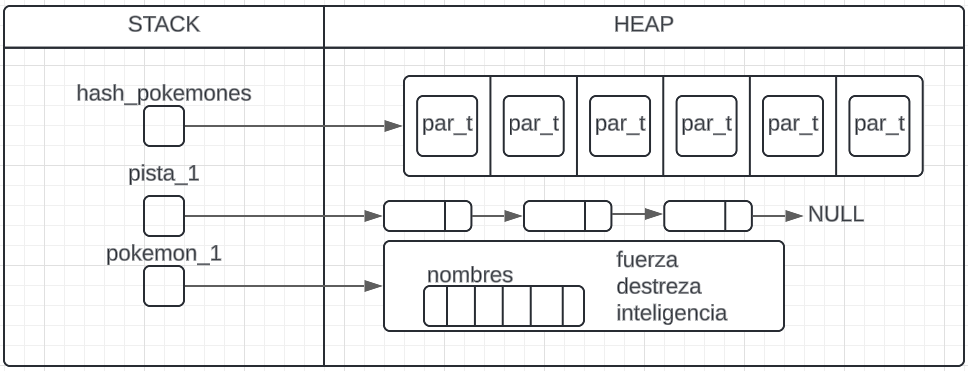
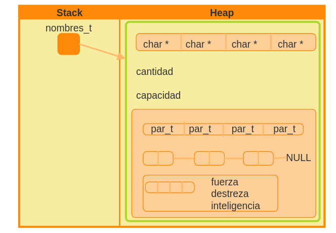
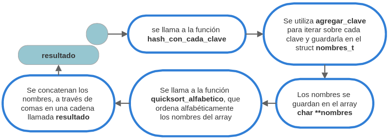
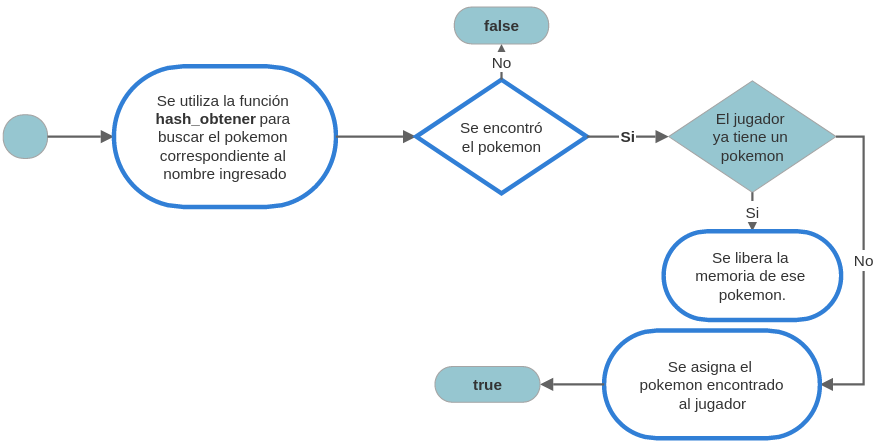
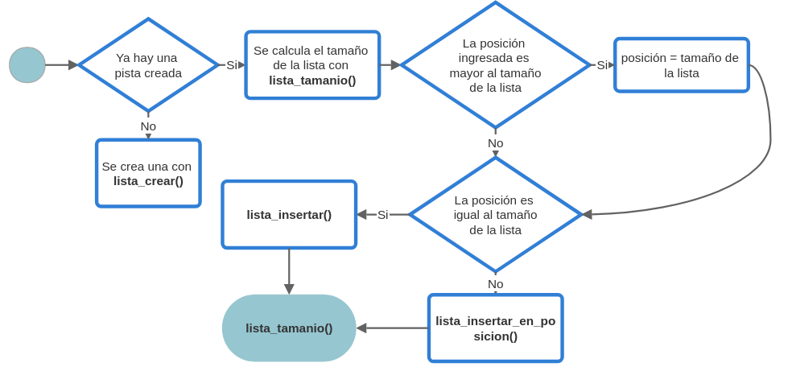

# TP: Carrera de obstáculos

## Repositorio de (Rocio Kraska) - (111340) - (rkraska@fi.uba.ar)

### Tabla de contenido
- [Comandos](#comandos)
- [Funcionamiento](#funcionamiento)
    - [Estructuras de datos](#estructuras-de-datos)
    - [Principales funciones](#principales-funciones)
- [Interfás](#interfás)
    - [Recomendaciones antes de jugar el juego](#recomendaciones-antes-de-jugar-el-juego)
    - [Flujo del juego](#flujo-del-juego)
- [Respuestas a las preguntas teóricas](#respuestas-a-las-preguntas-teóricas)
    - [Estructura interna de TP](#estructura-interna-de-tp)
    - [Complejidad](#complejidad)

## Comandos 
- Para ejecutar pruebas con valgrind:
```bash
make valgrind-alumno
```
- Para ejecutar juego con valgrind:
```bash
make valgrind-juego
```
---
##  Funcionamiento


### Estructuras de datos
```c
struct tp {
	hash_t *hash_pokemones;
	struct pokemon_info *pokemon_1;
	lista_t *pista_1;
	struct pokemon_info *pokemon_2;
	lista_t *pista_2;
};
```
<div align="center">

</div>

*Vea la explicación de esta estructura [acá](#estructura-interna-de-tp).*
### Principales funciones
#### tp_crear**:
- Se inicializan punteros en la estructura TP a NULL.
- Se utiliza fgets para leer líneas del archivo una por una en el buffer line.
- Para cada línea leída, se crea dinámicamente una estructura pokemon_info `(malloc(sizeof(struct pokemon_info)))`.
- Se utiliza strtok para dividir la línea en tokens separados por comas. Estos tokens se utilizan para llenar los campos de la estructura pokemon_info (nombre, fuerza, destreza, inteligencia).
- Si se obtienen correctamente todos los campos del Pokemon, se inserta este Pokemon en una tabla hash (hash_pokemones) usando hash_insertar.
- Finalmente, una vez que se han leído todas las líneas del archivo y se han insertado todos los Pokémon en la tabla hash, se cierra el archivo `fclose(file)` y se retorna el puntero a la estructura TP.
**tp_buscar_pokemon**:
- Se hace mayúscula a la primer letra del nombre del pokemon y luego se llama a *hash_obtener*, el cual devuelve NULL si ese nombre no pertenece a algún pokemon en el diccionario.
#### tp_nombres_disponibles
Se ultilizó la siguiente estructura:
``` c
typedef struct {
	char **nombres;
	size_t cantidad;
	size_t capacidad;
	TP *tp;
} nombres_t;
```
- Se optó usar esta estructura debido a que la función *hash_con_cada_clave* tenía una cantidad limitada de paramatros disponibles. Esta estructura contiene, un puntero a una cadena de caracteres, es decir un array de strings, tambien la cantidad de strings que contiene y su capacidad máxima.
- **agregar_clave**: Esta función es pasada como argumento a la función `hash_con_cada_clave`, que itera sobre cada clave almacenada en `tp->hash_pokemones`. Su objetivo es agregar los nombres de los Pokémon a la estructura *nombres_t* que se le pasa como parámetro a través de aux.
- Después de haber agregado todos los nombres al arreglo nombres.nombres, se llama a `quicksort_alfabetico` para ordenar estos nombres alfabéticamente.
- Se calcula total_length, que será el tamaño total necesario para almacenar todos los nombres y las comas que los separan, más un carácter nulo al final.
- Se asigna memoria para resultado, que tendrá tamaño `total_length + 1` para almacenar todos los nombres y las comas. Si la asignación de memoria falla, se libera la memoria previamente asignada para nombres.nombres y se retorna NULL.
- Se inicializa resultado como una cadena vacía `(resultado[0] = '\0')`. Se itera sobre cada nombre en nombres.nombres, se concatena al resultado y se añade una coma , si no es el último nombre. Luego se libera la memoria ocupada por cada nombre en nombres.nombres.
- Finalmente, se libera la memoria utilizada por nombres.nombres y se retorna resultado, que contiene todos los nombres de los Pokémon separados por comas y ordenados alfabéticamente.

<div align="center">

</div>


<div align="center">

</div>

#### tp_seleccionar_pokemon
- La primer letra del nombre ingresado se hace mayúscula y las que le siguen minúsculas
- Se utiliza `hash_obtener` para obtener el Pokémon correspondiente al nombre capitalizado desde la tabla hash `tp->hash_pokemones`.
-Si el Pokemon obtenido es NULL (no se encontró en la tabla hash), se libera la memoria la memoria correspondiente y devuelve `false`.
- Se determina qué jugador está seleccionando el Pokémon (JUGADOR_1 o JUGADOR_2). Se ajustan los punteros `poke_jugador_actual` y `poke_otro_jugador` para apuntar a los Pokémon del jugador actual y del otro jugador respectivamente.
- Se verifica si el Pokémon que se quiere seleccionar (nombre) ya está en posesión del otro jugador. Si es así, se libera la memoria correspondiente y se retorna `false`, ya que no se puede seleccionar un Pokémon que ya está en posesión del otro jugador.
- Si el jugador actual ya tiene un Pokémon seleccionado, se libera la memoria asignada para su nombre y para la estructura del Pokémon.
- Se asigna el puntero pokemon (el Pokémon obtenido de la tabla hash) a `*poke_jugador_actual`, indicando que ahora este jugador tiene este Pokémon seleccionado.
- Finalmente, se libera la memoria correspondiente y se retorna `true`, indicando que la selección del Pokémon fue exitosa.

<div align="center">

</div>


#### tp_agregar_obstaculo
- Determina qué lista `pista_actual` corresponde al jugador especificado (JUGADOR_1 o JUGADOR_2).
- Si la lista de la pista correspondiente no está creada, la crea utilizando `lista_crear()`.
- Calcula el tamaño actual de la lista pista_actual utilizando `lista_tamanio`.
- Verifica si la posición proporcionada es mayor que el tamaño actual de la pista. Si es así, ajusta posicion para que sea igual al tamaño actual de la pista.
- Se asigna memoria y valor al nuevo obstáculo.
- Si posicion es igual al tamaño actual de la pista, inserta nuevo_obstaculo al final de la lista utilizando `lista_insertar(pista_actual, nuevo_obstaculo)`. En caso contrario, inserta nuevo_obstaculo en la posición especificada utilizando `lista_insertar_en_posicion(pista_actual, nuevo_obstaculo, posicion)`.
- Si alguna operación de inserción falla, libera la memoria asignada para nuevo_obstaculo y retorna 0.
- Finalmente, retorna el tamaño actual de la pista, que representa la cantidad de obstáculos en la pista después de la inserción.

<div align="center">

</div>

#### tp_quitar_obstaculo
- Determina qué lista (pista_actual) corresponde al jugador especificado (JUGADOR_1 o JUGADOR_2).
- Si la lista de la pista correspondiente no está creada, la función devuelve 0.
- Utiliza `lista_quitar_de_posicion(pista_actual, posicion)` para quitar el obstáculo en la posición especificada de la lista pista_actual. lista_quitar_de_posicion devuelve un puntero al obstáculo quitado. Si no se encuentra ningún obstáculo en la posición especificada, devuelve NULL.
- Libera la memoria asignada para el obstáculo.
- Retorna el tamaño actual de la lista pista_actual, que representa la cantidad de obstáculos restantes en la pista después de quitar el obstáculo.
#### tp_obstaculos_pista
```c
typedef struct {
	char *obstaculos_pista;
	size_t posicion;
} obstaculos_pista_aux_t;
```
Esta estructura `obstaculos_pista_aux_t` se utiliza para almacenar temporalmente los obstáculos de una pista en forma de cadena y llevar un registro de la posición actual en esa cadena.

**agregar_obstaculo_a_string**: Esta función se utiliza con la función `lista_con_cada_elemento` para recorrer cada uno de los obstáculos en una lista y agregar sus identificadores correspondientes a la cadena `obstaculos_pista` dentro de la estructura `obstaculos_pista_aux_t`.

**tp_obstaculos_pista**: 
- Selecciona la lista pista_actual del jugador correspondiente.
- Si la lista no está creada o está vacía, retorna NULL.
- Asigna memoria para obstaculos_pista con un tamaño suficiente para almacenar todos los identificadores de los obstáculos más un carácter nulo `\0`.
- Inicializa una estructura aux de tipo obstaculos_pista_aux_t que contiene obstaculos_pista y posicion inicializados a 0.
- Utiliza `lista_con_cada_elemento` para recorrer cada obstáculo en pista_actual y agregar su identificador a obstaculos_pista utilizando `agregar_obstaculo_a_string`.
- Finaliza obstaculos_pista con un carácter nulo `\0`.
- Retorna obstaculos_pista, que contiene la cadena de identificadores de obstáculos de la pista del jugador.
#### tp_calcular_tiempo_pista
- Selecciona el Pokémon y la lista de obstáculos del jugador especificado. Si no hay Pokémon o la lista de pista está vacía, retorna 0.
- Inicializa `tiempo_final` como 0 para almacenar el tiempo total calculado.
- `tipo_obstaculo_previo` y `count` se utilizan para controlar obstáculos consecutivos del mismo tipo.
- Itera sobre cada obstáculo en la lista pista:

    - Obtener el tipo de obstáculo.
    - Determinar el atributo del Pokémon asociado al tipo de obstáculo.
    - Calcular el tiempo base en función del atributo.
    - Ajustar el tiempo base si hay obstáculos consecutivos del mismo tipo.
    - Sumar el tiempo del obstáculo al `tiempo_final`.
    - Actualizar `tipo_obstaculo_previo` con el tipo actual del obstáculo.

Retorna `tiempo_final`, que representa el tiempo total calculado para recorrer la pista de obstáculos.
#### tp_tiempo_por_abstaculo
Selecciona el Pokemon y la lista de obstáculos (pista) del jugador especificado. Si no hay Pokemon o la lista de pista está vacía, retorna NULL. Luego, calcula el número de obstáculos en la lista pista. Asigna memoria para `csv_tiempo` suficiente para almacenar los tiempos como cadena CSV. `prev_obstaculo_tipo` y `contador` se utilizan para controlar obstáculos consecutivos del mismo tipo. Crea un iterador para recorrer la lista pista.
Itera sobre cada obstáculo en la lista utilizando el iterador:
- Obtener el tipo de obstáculo.
- Determinar el atributo del Pokemon asociado al tipo de obstáculo.
- Calcular el tiempo base en función del atributo.
- Ajustar el tiempo base si hay obstáculos consecutivos del mismo tipo.
- Convertir el tiempo del obstáculo a cadena  y concatenarlo a `csv_tiempo`.
- Avanzar el iterador a la siguiente posición.
- Actualizar `prev_obstaculo_tipo` con el tipo actual del obstáculo.

Liberar el iterador y retornar `csv_tiempo`, que contiene los tiempos individuales de los obstáculos en forma de cadena CSV.
## Interfás
### Recomendaciones antes de jugar el juego
- Para que la interfás del juego se vea bien, el fondo de la terminal debe ser negro y ocupar toda la pantalla.
- Seguir las instrucciones del juego, Si se ingresa una opción inexistente (es decir, que no se muestre por pantalla) el juego tirará error.
### Flujo del juego
1. Pantalla principal donde puedes elegir JUGAR o SALIR
2. Si se eligió jugar, ahora te aparecen los 4 tipos de complejidades y sus atributos.
3. Una vez elegida la complejidad, te toca elegir un pokemon, el cual no vas a poder cambiar.
4. Luego se te va a mostarar el pokemon de tu contrincante, con sus atributos.
5. Luego te toca armar tu pista con abstaculos de Fuerza, Destreza e Inteligencia. A medida que los vas acomodando, se va mostrando en pantalla. Debes poner si o si la cantidad de obstaculos pertenecientes a tu dificultad.
6. Una vez termines tu pista, se va a mostrar la pista de tu enemigo, pero por algunos obstaculos ocultos.
7.  Luego se corre la carrera y se decide quién gano, y despendiendo de la dificultad que hayas elegido y en qué punto del juego está podrás o no jugar otra ronda.
8. En el caso de que puedas jugar otra ronda, irás devuelta el idem 6. Y tanto tu pokemon, como el pokemon y pista de tu contrincante serán las mismas, lo único que puede cambiar es tu pista.


---

## Respuestas a las preguntas teóricas

### Estructura interna de TP
-   Explique la estructura interna del tda **TP**. Explique por qué utilizó esa estructura.
*Ver diagrama de la estructura [acá](#estructuras-de-datos)*
#### Hash: hash_pokemones
- Este diccionario, basado en una Tabla de Hash cerrada (direccionamiento abierto). Se utilizó para almacenar los pokemones del archivo en la tabla. De forma tal que, asumiendo que no había pokemones repetidos, los nombres de los pokemones `pokemon->nombre` serían las claves de la tabla. 
- Sabiendo también que el usuario podía ingresar un nombre que quizás coincidía con el de alguno de los pokemones en el hash pero tener mayúsculas o minúsculas que no coincidan, se decidió, antes de modificar cualquier cosa de la tabla, se debe hacer mayúscula la primer letra y minúsculas las otras.
- El "valor" correspondiente a cada clave (el nombre de los pokemones), es igual al `struct pokemon_info` perteneciente a ese nombre.
**¿Por qué se eligió esta estructura?**
- En juegos donde se pueden usar nombres (o identificadores únicos) para acceder a objetos (como Pokémon), una estructura hash proporciona una manera natural de asociar estos nombres con la información correspondiente de manera rápida y directa.
#### Lista: pista_1 y pista_2
- La lista es simplemente enlazada.
- Sus nodos contienen caracteres que representan los obstáculos.
**¿Por qué se eligió esta estructura?**
- Las pistas de obstáculos se recorren secuencialmente por los Pokémon. Las listas son adecuadas para este tipo de recorrido, ya que permiten iterar fácilmente sobre los elementos en el orden en que fueron insertados.
#### ¿Por qué se eligió tener dos pistas y dos pokemones en el TP?
Al principio se había decido hacer una estructura aparte, llamada `jugador_t`, que contenga el pokemon y la pista de su respectivo jugador, pero su imprementación resultó bastante más compreja, y se decidió optar por una opción que requiera menos estructuras.
### Complejidad
-   Justifique la complejidad de las operaciones implementadas.
#### tp_crear
- Sabiendo que la función de hash_agregar, en el peor de los casos (con colisiones) es O(n) y que el bucle while se ejecuta n veces, por cada linea del archivo. En el peor de los casos la complejidad de esta función sería O(n²),
- Si la función hash_agregar no tienen colsiones, entonces su complejidad es de O(1), es decir que la complejidad de tp_crear es O(n).

#### tp_buscar_pokemon
- Verificación de punteros: O(1)
- Crear una copia modificable del nombre: O(m), siendo m la cantidad de caracteres del nombre.
- Capitalizar la primera letra y convertir las demás a minúsculas: O(m)
- Búsqueda en la tabla hash: O(1) en el mejor caso, O(n) en el peor caso
**Mejor caso:** 
O(m), donde m es la longitud del nombre.
**Peor caso:**
O(m + n), donde n es el número de elementos en la tabla hash y m es la longitud del nombre.

#### tp_nombres_disponibles
- Inicialización: O(1)
- Recorrido de la tabla hash y llamada a agregar_clave: O(n * m)
hash_con_cada_clave recorre todas las claves en la tabla hash y llama a agregar_clave para cada una. Si la tabla hash tiene n elementos, este recorrido es O(n), pero cada llamada a agregar_clave puede implicar operaciones de O(m) (siendo m la longitud del nombre del Pokemon), resultando en un tiempo total de O(n * m).
- Ordenamiento: O(n log n) el ordenamiento usando quicksort en promedio es O(n log n) y en el peor de los casos es de O(n²)
- Cálculo del tamaño total: O(n * m), ya que implica recorrer todas las cadenas y sumar sus longitudes.
**En el mejor caso:**
`O(n∗m) + O(nlogn)`, es decir, `O(n∗m)`
**En el peor caso:**
`O(n∗m) + O(n^2)`, es decir, `O(n^2)`

#### tp_buscar_pokemon
- Verificación de punteros y valores: O(1)
- Asignación de memoria y copia del nombre: O(m)
- Capitalizar primera letra: O(m)
- Búsqueda en la tabla hash: O(1) en el mejor caso, O(n) en el peor caso.
- Comparación de nombres: O(m)
**Mejor caso:** 
O(m), donde m es la longitud de nombre.
**Peor caso:** 
O(m + n), donde n es el número de elementos en la tabla hash y m es la longitud de nombre.

#### tp_agregar_obstaculo

- Verificaciones iniciales: O(1)
- Creación de la lista si no existe: O(1)
- Obtener el tamaño de la lista: lista_tamanio(pista_actual): O(n) (Recorre la lista para contar elementos)
- Inserción en la lista:
    - lista_insertar(pista_actual, nuevo_obstaculo): O(1) (Inserción al final de la lista)
    - lista_insertar_en_posicion(pista_actual, nuevo_obstaculo, posicion): O(n) (Inserción en una posición específica, ya que puede requerir recorrer la lista hasta esa posición)
**Complejidad: ** O(n) debido a la operación lista_tamanio(pista_actual) y lista_insertar_en_posicion.
#### tp_quitar_obstaculo
- Verificaciones iniciales: O(1)
- Obtener la lista del jugador: O(1)
- lista_quitar_de_posicion(pista_actual, posicion): O(n) (Debe recorrer la lista hasta la posición especificada)
- Obtener el tamaño de la lista después de la eliminación: lista_tamanio(pista_actual): O(n)
**Complejidad:** 
O(n) debido a las operaciones lista_quitar_de_posicion(pista_actual, posicion) y lista_tamanio(pista_actual).
#### tp_calcular_tiempo_pista
- Verificaciones iniciales (!tp, jugador != JUGADOR_1): O(1)
- Asignación de variables (pokemon y pista): O(1)
- Obtención del tamaño de la lista pista: lista_tamanio(pista): O(n) en el peor caso, donde n es la cantidad de obstáculos en la lista.
- Iteración sobre la lista pista: Recorre la lista de obstáculos una vez: O(n) en el peor caso.
- Operaciones dentro del bucle (switch y cálculos): O(1) por cada iteración.
**Complejidad:**
Por lo tanto, la complejidad total de tp_calcular_tiempo_pista en el peor caso es O(n), donde n es la cantidad de obstáculos en la lista pista.

#### tp_tiempo_por_obstaculo
- Verificaciones iniciales (!tp, jugador != JUGADOR_1): O(1)
- Asignación de variables (pokemon y pista): O(1)
- Obtención del tamaño de la lista pista: lista_tamanio(pista): O(n) en el peor caso, donde n es la cantidad de obstáculos en la lista.
- Creación de cadena para almacenar tiempos (csv_tiempo): `malloc((num_obstaculos * 5 + 1) * sizeof(char))` es O(num_obstaculos) en el peor caso, donde num_obstaculos es la cantidad de obstáculos.
- Iteración sobre la lista pista usando iterador: recorre la lista de obstáculos una vez, O(n) en el peor caso.
- Operaciones dentro del bucle (switch, sprintf, strcat): O(1) por cada iteración.

Por lo tanto, la complejidad total de tp_tiempo_por_obstaculo en el peor caso es O(n), donde n es la cantidad de obstáculos en la lista pista.


